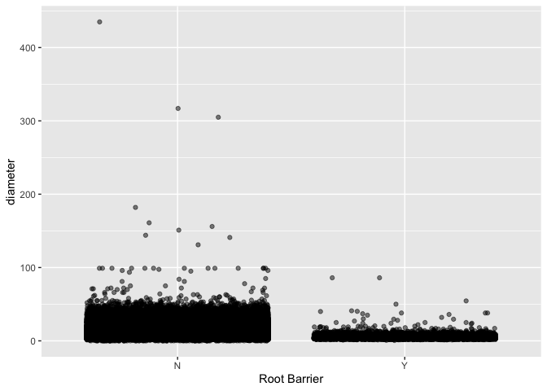
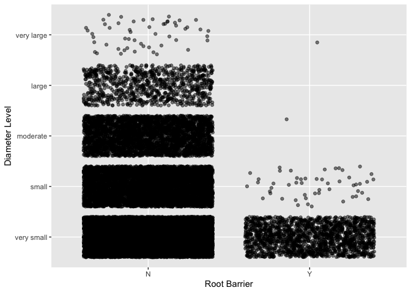

Mini Data Analysis Milestone 2
================

*To complete this milestone, you can edit [this `.rmd`
file](https://raw.githubusercontent.com/UBC-STAT/stat545.stat.ubc.ca/master/content/mini-project/mini-project-2.Rmd)
directly. Fill in the sections that are commented out with
`<!--- start your work here--->`. When you are done, make sure to knit
to an `.md` file by changing the output in the YAML header to
`github_document`, before submitting a tagged release on canvas.*

# Welcome to your second (and last) milestone in your mini data analysis project!

In Milestone 1, you explored your data, came up with research questions,
and obtained some results by making summary tables and graphs. This
time, we will first explore more in depth the concept of *tidy data.*
Then, you’ll be sharpening some of the results you obtained from your
previous milestone by:

-   Manipulating special data types in R: factors and/or dates and
    times.
-   Fitting a model object to your data, and extract a result.
-   Reading and writing data as separate files.

**NOTE**: The main purpose of the mini data analysis is to integrate
what you learn in class in an analysis. Although each milestone provides
a framework for you to conduct your analysis, it’s possible that you
might find the instructions too rigid for your data set. If this is the
case, you may deviate from the instructions – just make sure you’re
demonstrating a wide range of tools and techniques taught in this class.

# Instructions

**To complete this milestone**, edit [this very `.Rmd`
file](https://raw.githubusercontent.com/UBC-STAT/stat545.stat.ubc.ca/master/content/mini-project/mini-project-2.Rmd)
directly. Fill in the sections that are tagged with
`<!--- start your work here--->`.

**To submit this milestone**, make sure to knit this `.Rmd` file to an
`.md` file by changing the YAML output settings from
`output: html_document` to `output: github_document`. Commit and push
all of your work to your mini-analysis GitHub repository, and tag a
release on GitHub. Then, submit a link to your tagged release on canvas.

**Points**: This milestone is worth 55 points (compared to the 45 points
of the Milestone 1): 45 for your analysis, and 10 for your entire
mini-analysis GitHub repository. Details follow.

**Research Questions**: In Milestone 1, you chose two research questions
to focus on. Wherever realistic, your work in this milestone should
relate to these research questions whenever we ask for justification
behind your work. In the case that some tasks in this milestone don’t
align well with one of your research questions, feel free to discuss
your results in the context of a different research question.

# Learning Objectives

By the end of this milestone, you should:

-   Understand what *tidy* data is, and how to create it using `tidyr`.
-   Generate a reproducible and clear report using R Markdown.
-   Manipulating special data types in R: factors and/or dates and
    times.
-   Fitting a model object to your data, and extract a result.
-   Reading and writing data as separate files.

# Setup

Begin by loading your data and the tidyverse package below:

``` r
library(datateachr) # <- might contain the data you picked!
library(tidyverse)
```

# Task 1: Tidy your data (15 points)

In this task, we will do several exercises to reshape our data. The goal
here is to understand how to do this reshaping with the `tidyr` package.

A reminder of the definition of *tidy* data:

-   Each row is an **observation**
-   Each column is a **variable**
-   Each cell is a **value**

*Tidy’ing* data is sometimes necessary because it can simplify
computation. Other times it can be nice to organize data so that it can
be easier to understand when read manually.

### 2.1 (2.5 points)

Based on the definition above, can you identify if your data is tidy or
untidy? Go through all your columns, or if you have \>8 variables, just
pick 8, and explain whether the data is untidy or tidy.

<!--------------------------- Start your work below --------------------------->

``` r
glimpse(vancouver_trees) %>%
  print(n=20)
```

    ## Rows: 146,611
    ## Columns: 20
    ## $ tree_id            <dbl> 149556, 149563, 149579, 149590, 149604, 149616, 149…
    ## $ civic_number       <dbl> 494, 450, 4994, 858, 5032, 585, 4909, 4925, 4969, 7…
    ## $ std_street         <chr> "W 58TH AV", "W 58TH AV", "WINDSOR ST", "E 39TH AV"…
    ## $ genus_name         <chr> "ULMUS", "ZELKOVA", "STYRAX", "FRAXINUS", "ACER", "…
    ## $ species_name       <chr> "AMERICANA", "SERRATA", "JAPONICA", "AMERICANA", "C…
    ## $ cultivar_name      <chr> "BRANDON", NA, NA, "AUTUMN APPLAUSE", NA, "CHANTICL…
    ## $ common_name        <chr> "BRANDON ELM", "JAPANESE ZELKOVA", "JAPANESE SNOWBE…
    ## $ assigned           <chr> "N", "N", "N", "Y", "N", "N", "N", "N", "N", "N", "…
    ## $ root_barrier       <chr> "N", "N", "N", "N", "N", "N", "N", "N", "N", "N", "…
    ## $ plant_area         <chr> "N", "N", "4", "4", "4", "B", "6", "6", "3", "3", "…
    ## $ on_street_block    <dbl> 400, 400, 4900, 800, 5000, 500, 4900, 4900, 4900, 7…
    ## $ on_street          <chr> "W 58TH AV", "W 58TH AV", "WINDSOR ST", "E 39TH AV"…
    ## $ neighbourhood_name <chr> "MARPOLE", "MARPOLE", "KENSINGTON-CEDAR COTTAGE", "…
    ## $ street_side_name   <chr> "EVEN", "EVEN", "EVEN", "EVEN", "EVEN", "ODD", "ODD…
    ## $ height_range_id    <dbl> 2, 4, 3, 4, 2, 2, 3, 3, 2, 2, 2, 5, 3, 2, 2, 2, 2, …
    ## $ diameter           <dbl> 10.00, 10.00, 4.00, 18.00, 9.00, 5.00, 15.00, 14.00…
    ## $ curb               <chr> "N", "N", "Y", "Y", "Y", "Y", "Y", "Y", "Y", "Y", "…
    ## $ date_planted       <date> 1999-01-13, 1996-05-31, 1993-11-22, 1996-04-29, 19…
    ## $ longitude          <dbl> -123.1161, -123.1147, -123.0846, -123.0870, -123.08…
    ## $ latitude           <dbl> 49.21776, 49.21776, 49.23938, 49.23469, 49.23894, 4…
    ## # A tibble: 146,611 × 20
    ##    tree_id civic_number std_st…¹ genus…² speci…³ culti…⁴ commo…⁵ assig…⁶ root_…⁷
    ##      <dbl>        <dbl> <chr>    <chr>   <chr>   <chr>   <chr>   <chr>   <chr>  
    ##  1  149556          494 W 58TH … ULMUS   AMERIC… BRANDON BRANDO… N       N      
    ##  2  149563          450 W 58TH … ZELKOVA SERRATA <NA>    JAPANE… N       N      
    ##  3  149579         4994 WINDSOR… STYRAX  JAPONI… <NA>    JAPANE… N       N      
    ##  4  149590          858 E 39TH … FRAXIN… AMERIC… AUTUMN… AUTUMN… Y       N      
    ##  5  149604         5032 WINDSOR… ACER    CAMPES… <NA>    HEDGE … N       N      
    ##  6  149616          585 W 61ST … PYRUS   CALLER… CHANTI… CHANTI… N       N      
    ##  7  149617         4909 SHERBRO… ACER    PLATAN… COLUMN… COLUMN… N       N      
    ##  8  149618         4925 SHERBRO… ACER    PLATAN… COLUMN… COLUMN… N       N      
    ##  9  149619         4969 SHERBRO… ACER    PLATAN… COLUMN… COLUMN… N       N      
    ## 10  149625          720 E 39TH … FRAXIN… AMERIC… AUTUMN… AUTUMN… N       N      
    ## 11  149626          736 E 39TH … TILIA   EUCHLO… <NA>    CRIMEA… N       N      
    ## 12  149636          812 E 39TH … TILIA   EUCHLO… <NA>    CRIMEA… Y       N      
    ## 13  149640         6968 SELKIRK… ACER    PLATAN… COLUMN… COLUMN… N       N      
    ## 14  149646          505 E 16TH … HIBISC… SYRIACA <NA>    ROSE O… N       N      
    ## 15  149647          509 E 16TH … STYRAX  JAPONI… <NA>    JAPANE… N       N      
    ## 16  149658         5208 WINDSOR… STYRAX  JAPONI… <NA>    JAPANE… N       N      
    ## 17  149673         5241 WINDSOR… FRAXIN… OXYCAR… RAYWOOD RAYWOO… N       N      
    ## 18  149680         5311 WINDSOR… ACER    CAMPES… <NA>    HEDGE … N       N      
    ## 19  149683         7011 SELKIRK… ACER    PLATAN… COLUMN… COLUMN… N       N      
    ## 20  149684         1223 W 54TH … ACER    PLATAN… COLUMN… COLUMN… N       N      
    ## # … with 146,591 more rows, 11 more variables: plant_area <chr>,
    ## #   on_street_block <dbl>, on_street <chr>, neighbourhood_name <chr>,
    ## #   street_side_name <chr>, height_range_id <dbl>, diameter <dbl>, curb <chr>,
    ## #   date_planted <date>, longitude <dbl>, latitude <dbl>, and abbreviated
    ## #   variable names ¹​std_street, ²​genus_name, ³​species_name, ⁴​cultivar_name,
    ## #   ⁵​common_name, ⁶​assigned, ⁷​root_barrier

I think the data is not tidy. ‘std_street’ and ‘on_street’ is the same
value and can be collapsed into one variable or column.

Now that I notice the repetition in ‘std_street’ and ‘on_street’, we can
actually combine ‘civic_number’ and ‘std_street’ to retrieve the full
address and form a new variable. In that case, it would be good to also
combine ‘on_street_block’ and ‘on_street’ to form another new variable
to capture the full information.

<!----------------------------------------------------------------------------->

### 2.2 (5 points)

Now, if your data is tidy, untidy it! Then, tidy it back to it’s
original state.

If your data is untidy, then tidy it! Then, untidy it back to it’s
original state.

Be sure to explain your reasoning for this task. Show us the “before”
and “after”.

<!--------------------------- Start your work below --------------------------->

**Original State**

``` r
glimpse(vancouver_trees) %>%
  print(n=10)
```

    ## Rows: 146,611
    ## Columns: 20
    ## $ tree_id            <dbl> 149556, 149563, 149579, 149590, 149604, 149616, 149…
    ## $ civic_number       <dbl> 494, 450, 4994, 858, 5032, 585, 4909, 4925, 4969, 7…
    ## $ std_street         <chr> "W 58TH AV", "W 58TH AV", "WINDSOR ST", "E 39TH AV"…
    ## $ genus_name         <chr> "ULMUS", "ZELKOVA", "STYRAX", "FRAXINUS", "ACER", "…
    ## $ species_name       <chr> "AMERICANA", "SERRATA", "JAPONICA", "AMERICANA", "C…
    ## $ cultivar_name      <chr> "BRANDON", NA, NA, "AUTUMN APPLAUSE", NA, "CHANTICL…
    ## $ common_name        <chr> "BRANDON ELM", "JAPANESE ZELKOVA", "JAPANESE SNOWBE…
    ## $ assigned           <chr> "N", "N", "N", "Y", "N", "N", "N", "N", "N", "N", "…
    ## $ root_barrier       <chr> "N", "N", "N", "N", "N", "N", "N", "N", "N", "N", "…
    ## $ plant_area         <chr> "N", "N", "4", "4", "4", "B", "6", "6", "3", "3", "…
    ## $ on_street_block    <dbl> 400, 400, 4900, 800, 5000, 500, 4900, 4900, 4900, 7…
    ## $ on_street          <chr> "W 58TH AV", "W 58TH AV", "WINDSOR ST", "E 39TH AV"…
    ## $ neighbourhood_name <chr> "MARPOLE", "MARPOLE", "KENSINGTON-CEDAR COTTAGE", "…
    ## $ street_side_name   <chr> "EVEN", "EVEN", "EVEN", "EVEN", "EVEN", "ODD", "ODD…
    ## $ height_range_id    <dbl> 2, 4, 3, 4, 2, 2, 3, 3, 2, 2, 2, 5, 3, 2, 2, 2, 2, …
    ## $ diameter           <dbl> 10.00, 10.00, 4.00, 18.00, 9.00, 5.00, 15.00, 14.00…
    ## $ curb               <chr> "N", "N", "Y", "Y", "Y", "Y", "Y", "Y", "Y", "Y", "…
    ## $ date_planted       <date> 1999-01-13, 1996-05-31, 1993-11-22, 1996-04-29, 19…
    ## $ longitude          <dbl> -123.1161, -123.1147, -123.0846, -123.0870, -123.08…
    ## $ latitude           <dbl> 49.21776, 49.21776, 49.23938, 49.23469, 49.23894, 4…
    ## # A tibble: 146,611 × 20
    ##    tree_id civic_number std_st…¹ genus…² speci…³ culti…⁴ commo…⁵ assig…⁶ root_…⁷
    ##      <dbl>        <dbl> <chr>    <chr>   <chr>   <chr>   <chr>   <chr>   <chr>  
    ##  1  149556          494 W 58TH … ULMUS   AMERIC… BRANDON BRANDO… N       N      
    ##  2  149563          450 W 58TH … ZELKOVA SERRATA <NA>    JAPANE… N       N      
    ##  3  149579         4994 WINDSOR… STYRAX  JAPONI… <NA>    JAPANE… N       N      
    ##  4  149590          858 E 39TH … FRAXIN… AMERIC… AUTUMN… AUTUMN… Y       N      
    ##  5  149604         5032 WINDSOR… ACER    CAMPES… <NA>    HEDGE … N       N      
    ##  6  149616          585 W 61ST … PYRUS   CALLER… CHANTI… CHANTI… N       N      
    ##  7  149617         4909 SHERBRO… ACER    PLATAN… COLUMN… COLUMN… N       N      
    ##  8  149618         4925 SHERBRO… ACER    PLATAN… COLUMN… COLUMN… N       N      
    ##  9  149619         4969 SHERBRO… ACER    PLATAN… COLUMN… COLUMN… N       N      
    ## 10  149625          720 E 39TH … FRAXIN… AMERIC… AUTUMN… AUTUMN… N       N      
    ## # … with 146,601 more rows, 11 more variables: plant_area <chr>,
    ## #   on_street_block <dbl>, on_street <chr>, neighbourhood_name <chr>,
    ## #   street_side_name <chr>, height_range_id <dbl>, diameter <dbl>, curb <chr>,
    ## #   date_planted <date>, longitude <dbl>, latitude <dbl>, and abbreviated
    ## #   variable names ¹​std_street, ²​genus_name, ³​species_name, ⁴​cultivar_name,
    ## #   ⁵​common_name, ⁶​assigned, ⁷​root_barrier

**Tidying the data** At first I was confused why ‘std_street’ and
‘on_street’ were variables in the original data but rather than
simplifying these two variables together, I will combine these variables
with ‘civic_number’ and ‘on_street_block’ respectively to produce the
full house address and full block address of each tree.

``` r
vancouver_trees_tidy <- vancouver_trees %>%
  unite(col = house_address, c(civic_number, std_street), sep = "-") %>%
  unite(col = block_address, c(on_street_block, on_street), sep = "-") %>%
  print(n=10)
```

    ## # A tibble: 146,611 × 18
    ##    tree_id house_address genus…¹ speci…² culti…³ commo…⁴ assig…⁵ root_…⁶ plant…⁷
    ##      <dbl> <chr>         <chr>   <chr>   <chr>   <chr>   <chr>   <chr>   <chr>  
    ##  1  149556 494-W 58TH AV ULMUS   AMERIC… BRANDON BRANDO… N       N       N      
    ##  2  149563 450-W 58TH AV ZELKOVA SERRATA <NA>    JAPANE… N       N       N      
    ##  3  149579 4994-WINDSOR… STYRAX  JAPONI… <NA>    JAPANE… N       N       4      
    ##  4  149590 858-E 39TH AV FRAXIN… AMERIC… AUTUMN… AUTUMN… Y       N       4      
    ##  5  149604 5032-WINDSOR… ACER    CAMPES… <NA>    HEDGE … N       N       4      
    ##  6  149616 585-W 61ST AV PYRUS   CALLER… CHANTI… CHANTI… N       N       B      
    ##  7  149617 4909-SHERBRO… ACER    PLATAN… COLUMN… COLUMN… N       N       6      
    ##  8  149618 4925-SHERBRO… ACER    PLATAN… COLUMN… COLUMN… N       N       6      
    ##  9  149619 4969-SHERBRO… ACER    PLATAN… COLUMN… COLUMN… N       N       3      
    ## 10  149625 720-E 39TH AV FRAXIN… AMERIC… AUTUMN… AUTUMN… N       N       3      
    ## # … with 146,601 more rows, 9 more variables: block_address <chr>,
    ## #   neighbourhood_name <chr>, street_side_name <chr>, height_range_id <dbl>,
    ## #   diameter <dbl>, curb <chr>, date_planted <date>, longitude <dbl>,
    ## #   latitude <dbl>, and abbreviated variable names ¹​genus_name, ²​species_name,
    ## #   ³​cultivar_name, ⁴​common_name, ⁵​assigned, ⁶​root_barrier, ⁷​plant_area

**Untidying to the original state** To untidy the data to the original
state, I will separate the columns that I have united together.

``` r
vancouver_trees_untidy <- vancouver_trees_tidy %>%
  separate(col = house_address, c("civic_number", "std_street"), sep = '-') %>%
  separate(col = block_address, c("on_street_block", "on_street"), sep = '-') %>%
  print(n=10)
```

    ## Warning: Expected 2 pieces. Additional pieces discarded in 11 rows [6011, 24172,
    ## 49290, 49291, 80989, 80990, 82452, 82453, 88280, 113473, 137060].

    ## Warning: Expected 2 pieces. Additional pieces discarded in 10 rows [6011, 24172,
    ## 49290, 49291, 82452, 82453, 88280, 113473, 113854, 137060].

    ## # A tibble: 146,611 × 20
    ##    tree_id civic_number std_st…¹ genus…² speci…³ culti…⁴ commo…⁵ assig…⁶ root_…⁷
    ##      <dbl> <chr>        <chr>    <chr>   <chr>   <chr>   <chr>   <chr>   <chr>  
    ##  1  149556 494          W 58TH … ULMUS   AMERIC… BRANDON BRANDO… N       N      
    ##  2  149563 450          W 58TH … ZELKOVA SERRATA <NA>    JAPANE… N       N      
    ##  3  149579 4994         WINDSOR… STYRAX  JAPONI… <NA>    JAPANE… N       N      
    ##  4  149590 858          E 39TH … FRAXIN… AMERIC… AUTUMN… AUTUMN… Y       N      
    ##  5  149604 5032         WINDSOR… ACER    CAMPES… <NA>    HEDGE … N       N      
    ##  6  149616 585          W 61ST … PYRUS   CALLER… CHANTI… CHANTI… N       N      
    ##  7  149617 4909         SHERBRO… ACER    PLATAN… COLUMN… COLUMN… N       N      
    ##  8  149618 4925         SHERBRO… ACER    PLATAN… COLUMN… COLUMN… N       N      
    ##  9  149619 4969         SHERBRO… ACER    PLATAN… COLUMN… COLUMN… N       N      
    ## 10  149625 720          E 39TH … FRAXIN… AMERIC… AUTUMN… AUTUMN… N       N      
    ## # … with 146,601 more rows, 11 more variables: plant_area <chr>,
    ## #   on_street_block <chr>, on_street <chr>, neighbourhood_name <chr>,
    ## #   street_side_name <chr>, height_range_id <dbl>, diameter <dbl>, curb <chr>,
    ## #   date_planted <date>, longitude <dbl>, latitude <dbl>, and abbreviated
    ## #   variable names ¹​std_street, ²​genus_name, ³​species_name, ⁴​cultivar_name,
    ## #   ⁵​common_name, ⁶​assigned, ⁷​root_barrier

<!----------------------------------------------------------------------------->

### 2.3 (7.5 points)

Now, you should be more familiar with your data, and also have made
progress in answering your research questions. Based on your interest,
and your analyses, pick 2 of the 4 research questions to continue your
analysis in the next four tasks:

<!-------------------------- Start your work below ---------------------------->

1.  Does having a root barrier result in a smaller diameter in the 4
    most common species in the Acer genus?
2.  Is the height range of the 4 most common species in the Acer genus
    getting smaller from 2000 until now?

<!----------------------------------------------------------------------------->

Explain your decision for choosing the above two research questions.
<!--------------------------- Start your work below ---------------------------> 1.
I was originally going to use this question from Milestone 1, “Does
having a root barrier result in smaller tree diameter?” but I think I
was too broad. I am narrowing it down to look at the most common genus
which I have identified as Acer. Since there are many species in the
Acer genus, I will be looking at the 4 most common species in this
genus.

``` r
vancouver_trees %>%
group_by(genus_name) %>%
summarize(count = n()) %>%
arrange(desc(count))
```

    ## # A tibble: 97 × 2
    ##    genus_name count
    ##    <chr>      <int>
    ##  1 ACER       36062
    ##  2 PRUNUS     30683
    ##  3 FRAXINUS    7381
    ##  4 TILIA       6773
    ##  5 QUERCUS     6119
    ##  6 CARPINUS    5806
    ##  7 FAGUS       4808
    ##  8 MALUS       4173
    ##  9 MAGNOLIA    3899
    ## 10 CRATAEGUS   3864
    ## # … with 87 more rows

2.  For question 2, my original question from Milestone 1 was, “Is the
    height range of trees getting smaller as the years go on?” but I
    realize that is not specific enough. From my previous milestone
    assignment, I noticed that the height range started to decline after
    2000 so I want to see if this is true for the 4 most common species
    in the Acer genus.

<!----------------------------------------------------------------------------->

Now, try to choose a version of your data that you think will be
appropriate to answer these 2 questions. Use between 4 and 8 functions
that we’ve covered so far (i.e. by filtering, cleaning, tidy’ing,
dropping irrelevant columns, etc.).

<!--------------------------- Start your work below --------------------------->

``` r
#Choosing trees in the Acer genus
vancouver_trees_acer <- vancouver_trees %>%
  filter(genus_name == "ACER")

#Finding the 4 most common species under the Acer genus
vancouver_trees_acer %>%
  group_by(species_name) %>%
  summarize(count = n()) %>%
  arrange(desc(count))
```

    ## # A tibble: 31 × 2
    ##    species_name   count
    ##    <chr>          <int>
    ##  1 PLATANOIDES    11963
    ##  2 RUBRUM          8467
    ##  3 FREEMANI   X    4164
    ##  4 CAMPESTRE       3477
    ##  5 PSEUDOPLATANUS  2091
    ##  6 TRUNCATUM       1918
    ##  7 PALMATUM        1037
    ##  8 GRISEUM          510
    ##  9 CAPPADOCICUM     417
    ## 10 MACROPHYLLUM     398
    ## # … with 21 more rows

``` r
#Filtering the dataset to have only the 4 most common species and selecting variables that I will be looking at
vancouver_trees_4subset <- vancouver_trees_acer %>%
  filter(species_name %in% c("PLATANOIDES", "RUBRUM", "FREEMANI X", "CAMPESTRE")) %>%
  select(c("tree_id", "species_name", "root_barrier", "height_range_id", "diameter", "date_planted")) %>%
  print(n=5)
```

    ## # A tibble: 23,907 × 6
    ##   tree_id species_name root_barrier height_range_id diameter date_planted
    ##     <dbl> <chr>        <chr>                  <dbl>    <dbl> <date>      
    ## 1  149604 CAMPESTRE    N                          2        9 1993-12-17  
    ## 2  149617 PLATANOIDES  N                          3       15 1993-12-16  
    ## 3  149618 PLATANOIDES  N                          3       14 1993-12-16  
    ## 4  149619 PLATANOIDES  N                          2       16 1993-12-16  
    ## 5  149640 PLATANOIDES  N                          3       18 1993-12-15  
    ## # … with 23,902 more rows

I will be working with vancouver_trees_4subset as my dataset going
forward.
<!----------------------------------------------------------------------------->

# Task 2: Special Data Types (10)

For this exercise, you’ll be choosing two of the three tasks below –
both tasks that you choose are worth 5 points each.

But first, tasks 1 and 2 below ask you to modify a plot you made in a
previous milestone. The plot you choose should involve plotting across
at least three groups (whether by facetting, or using an aesthetic like
colour). Place this plot below (you’re allowed to modify the plot if
you’d like). If you don’t have such a plot, you’ll need to make one.
Place the code for your plot below.

<!-------------------------- Start your work below ---------------------------->

This plot is taken from Milestone 1

``` r
ggplot(vancouver_trees, aes(root_barrier, diameter)) + geom_jitter(alpha = 0.5) + xlab("Root Barrier") 
```

<!-- -->

<!----------------------------------------------------------------------------->

Now, choose two of the following tasks.

1.  Produce a new plot that reorders a factor in your original plot,
    using the `forcats` package (3 points). Then, in a sentence or two,
    briefly explain why you chose this ordering (1 point here for
    demonstrating understanding of the reordering, and 1 point for
    demonstrating some justification for the reordering, which could be
    subtle or speculative.)

2.  Produce a new plot that groups some factor levels together into an
    “other” category (or something similar), using the `forcats` package
    (3 points). Then, in a sentence or two, briefly explain why you
    chose this grouping (1 point here for demonstrating understanding of
    the grouping, and 1 point for demonstrating some justification for
    the grouping, which could be subtle or speculative.)

3.  If your data has some sort of time-based column like a date (but
    something more granular than just a year):

    1.  Make a new column that uses a function from the `lubridate` or
        `tsibble` package to modify your original time-based column. (3
        points)

        -   Note that you might first have to *make* a time-based column
            using a function like `ymd()`, but this doesn’t count.
        -   Examples of something you might do here: extract the day of
            the year from a date, or extract the weekday, or let 24
            hours elapse on your dates.

    2.  Then, in a sentence or two, explain how your new column might be
        useful in exploring a research question. (1 point for
        demonstrating understanding of the function you used, and 1
        point for your justification, which could be subtle or
        speculative).

        -   For example, you could say something like “Investigating the
            day of the week might be insightful because penguins don’t
            work on weekends, and so may respond differently”.

<!-------------------------- Start your work below ---------------------------->

**Task Number**: 2 I will be using research question 1.

``` r
vancouver_trees_dfct <- vancouver_trees_4subset %>%
  mutate(diameter_level = factor(case_when(diameter < 10 ~ "very small",
                                    diameter < 20 ~ "small",
                                    diameter < 30 ~ "moderate",
                                    diameter < 40 ~ "large",
                                    TRUE ~ "very large"),
                               levels = c("very small", "small", "moderate", "large", "very large")))
levels(vancouver_trees_dfct$diameter_level)
```

    ## [1] "very small" "small"      "moderate"   "large"      "very large"

``` r
vancouver_trees_dfct
```

    ## # A tibble: 23,907 × 7
    ##    tree_id species_name root_barrier height_range_id diameter date_pla…¹ diame…²
    ##      <dbl> <chr>        <chr>                  <dbl>    <dbl> <date>     <fct>  
    ##  1  149604 CAMPESTRE    N                          2     9    1993-12-17 very s…
    ##  2  149617 PLATANOIDES  N                          3    15    1993-12-16 small  
    ##  3  149618 PLATANOIDES  N                          3    14    1993-12-16 small  
    ##  4  149619 PLATANOIDES  N                          2    16    1993-12-16 small  
    ##  5  149640 PLATANOIDES  N                          3    18    1993-12-15 small  
    ##  6  149680 CAMPESTRE    N                          2    10.2  1993-12-20 small  
    ##  7  149683 PLATANOIDES  N                          3    19.5  1993-12-15 small  
    ##  8  149684 PLATANOIDES  N                          2    14    1993-12-15 small  
    ##  9  149686 CAMPESTRE    N                          2     9.75 1993-12-15 very s…
    ## 10  149694 PLATANOIDES  N                          3    13.5  1993-12-09 small  
    ## # … with 23,897 more rows, and abbreviated variable names ¹​date_planted,
    ## #   ²​diameter_level

``` r
ggplot(vancouver_trees_dfct, aes(root_barrier, diameter_level)) + geom_jitter(alpha = 0.5) + xlab("Root Barrier") + ylab("Diameter Level")
```

<!-- --> I
chose to group diameter as a variable to level because previously it was
a numeric variable but now, I have categorized it by “very small”,
“small”, “moderate”, “large” and “very large”. In the graph from
Milestone 1, you would see that there is a larger band of points in
trees without a root barrier than trees that do. In this graph that
looks at diameter levels, it gives additional detail that trees that do
not have root barriers are generally at least moderate height whereas
trees with root barriers are generally in the very small range.
<!----------------------------------------------------------------------------->

<!-------------------------- Start your work below ---------------------------->

**Task Number**: 3 I will be using research question 2.

``` r
library(lubridate)
```

    ## 
    ## Attaching package: 'lubridate'

    ## The following objects are masked from 'package:base':
    ## 
    ##     date, intersect, setdiff, union

``` r
#Filtering the dataset to only have trees planted starting from 2000 until now
vancouver_trees_2000 <- vancouver_trees_4subset %>%
  filter(date_planted >= "2000-01-01") %>%
  arrange(date_planted) %>%
  print(n=5)
```

    ## # A tibble: 8,332 × 6
    ##   tree_id species_name root_barrier height_range_id diameter date_planted
    ##     <dbl> <chr>        <chr>                  <dbl>    <dbl> <date>      
    ## 1  181932 RUBRUM       N                          3      5   2000-01-07  
    ## 2  181930 RUBRUM       N                          2      3   2000-01-07  
    ## 3  181933 RUBRUM       N                          3      4   2000-01-07  
    ## 4  174282 RUBRUM       N                          4     13.5 2000-01-07  
    ## 5  182615 CAMPESTRE    N                          1      3   2000-01-08  
    ## # … with 8,327 more rows

``` r
vancouver_trees_date <- vancouver_trees_2000 %>%
  mutate(quarter_planted = quarter(date_planted)) %>%
  print(n=5)
```

    ## # A tibble: 8,332 × 7
    ##   tree_id species_name root_barrier height_range_id diameter date_plan…¹ quart…²
    ##     <dbl> <chr>        <chr>                  <dbl>    <dbl> <date>        <int>
    ## 1  181932 RUBRUM       N                          3      5   2000-01-07        1
    ## 2  181930 RUBRUM       N                          2      3   2000-01-07        1
    ## 3  181933 RUBRUM       N                          3      4   2000-01-07        1
    ## 4  174282 RUBRUM       N                          4     13.5 2000-01-07        1
    ## 5  182615 CAMPESTRE    N                          1      3   2000-01-08        1
    ## # … with 8,327 more rows, and abbreviated variable names ¹​date_planted,
    ## #   ²​quarter_planted

I chose to create a new column that shows that quarter of the year the
tree is planted in. Quarter 1 = Jan - March, Quarter 2: April - June,
Quarter 3: July - September, Quarter 4: October - December. This
information may be useful if we are looking to compare trees planted in
the dry months (quarter 2 & 3) versus wet months (quarter 1 & 2).
<!----------------------------------------------------------------------------->

# Task 3: Modelling

## 2.0 (no points)

Pick a research question, and pick a variable of interest (we’ll call it
“Y”) that’s relevant to the research question. Indicate these.

<!-------------------------- Start your work below ---------------------------->

**Research Question**: Is there association between diameter and
presence of a root barrier? Null Hypothesis: The diameter of trees is
not associated with the presence of a root barrier. Alternative
Hypothesis: The diameter of trees is associated with the presence of a
root barrier.

**Variable of interest**: Diameter

<!----------------------------------------------------------------------------->

## 2.1 (5 points)

Fit a model or run a hypothesis test that provides insight on this
variable with respect to the research question. Store the model object
as a variable, and print its output to screen. We’ll omit having to
justify your choice, because we don’t expect you to know about model
specifics in STAT 545.

-   **Note**: It’s OK if you don’t know how these models/tests work.
    Here are some examples of things you can do here, but the sky’s the
    limit.

    -   You could fit a model that makes predictions on Y using another
        variable, by using the `lm()` function.
    -   You could test whether the mean of Y equals 0 using `t.test()`,
        or maybe the mean across two groups are different using
        `t.test()`, or maybe the mean across multiple groups are
        different using `anova()` (you may have to pivot your data for
        the latter two).
    -   You could use `lm()` to test for significance of regression.

<!-------------------------- Start your work below ---------------------------->

``` r
vancouver_trees_lm <- lm(diameter ~ root_barrier, vancouver_trees_4subset)
summary(vancouver_trees_lm)
```

    ## 
    ## Call:
    ## lm(formula = diameter ~ root_barrier, data = vancouver_trees_4subset)
    ## 
    ## Residuals:
    ##     Min      1Q  Median      3Q     Max 
    ## -11.614  -7.614  -1.614   4.886 149.386 
    ## 
    ## Coefficients:
    ##               Estimate Std. Error t value Pr(>|t|)    
    ## (Intercept)   11.61438    0.05779  200.99   <2e-16 ***
    ## root_barrierY -7.26084    0.21083  -34.44   <2e-16 ***
    ## ---
    ## Signif. codes:  0 '***' 0.001 '**' 0.01 '*' 0.05 '.' 0.1 ' ' 1
    ## 
    ## Residual standard error: 8.593 on 23905 degrees of freedom
    ## Multiple R-squared:  0.04727,    Adjusted R-squared:  0.04723 
    ## F-statistic:  1186 on 1 and 23905 DF,  p-value: < 2.2e-16

<!----------------------------------------------------------------------------->

## 2.2 (5 points)

Produce something relevant from your fitted model: either predictions on
Y, or a single value like a regression coefficient or a p-value.

-   Be sure to indicate in writing what you chose to produce.
-   Your code should either output a tibble (in which case you should
    indicate the column that contains the thing you’re looking for), or
    the thing you’re looking for itself.
-   Obtain your results using the `broom` package if possible. If your
    model is not compatible with the broom function you’re needing, then
    you can obtain your results by some other means, but first indicate
    which broom function is not compatible.

<!-------------------------- Start your work below ---------------------------->

``` r
#Finding p-value from broom package
library(broom)
tidy(vancouver_trees_lm)
```

    ## # A tibble: 2 × 5
    ##   term          estimate std.error statistic   p.value
    ##   <chr>            <dbl>     <dbl>     <dbl>     <dbl>
    ## 1 (Intercept)      11.6     0.0578     201.  0        
    ## 2 root_barrierY    -7.26    0.211      -34.4 1.03e-253

The p-value less than 0.05 which suggests that the null hypothesis is
false and that there is association between diameter and presence of a
root barrier.

``` r
aug_lm <- augment(vancouver_trees_lm)
head(aug_lm)
```

    ## # A tibble: 6 × 8
    ##   diameter root_barrier .fitted .resid      .hat .sigma     .cooksd .std.resid
    ##      <dbl> <chr>          <dbl>  <dbl>     <dbl>  <dbl>       <dbl>      <dbl>
    ## 1      9   N               11.6  -2.61 0.0000452   8.59 0.00000209      -0.304
    ## 2     15   N               11.6   3.39 0.0000452   8.59 0.00000351       0.394
    ## 3     14   N               11.6   2.39 0.0000452   8.59 0.00000174       0.278
    ## 4     16   N               11.6   4.39 0.0000452   8.59 0.00000589       0.510
    ## 5     18   N               11.6   6.39 0.0000452   8.59 0.0000125        0.743
    ## 6     10.2 N               11.6  -1.36 0.0000452   8.59 0.000000570     -0.159

<!----------------------------------------------------------------------------->

# Task 4: Reading and writing data

Get set up for this exercise by making a folder called `output` in the
top level of your project folder / repository. You’ll be saving things
there.

## 3.1 (5 points)

Take a summary table that you made from Milestone 1 (Task 4.2), and
write it as a csv file in your `output` folder. Use the `here::here()`
function.

-   **Robustness criteria**: You should be able to move your Mini
    Project repository / project folder to some other location on your
    computer, or move this very Rmd file to another location within your
    project repository / folder, and your code should still work.
-   **Reproducibility criteria**: You should be able to delete the csv
    file, and remake it simply by knitting this Rmd file.

<!-------------------------- Start your work below ---------------------------->

I will create a summary table based on Milestone 1 and adapt it to my
new dataset from this milestone.

``` r
diameter_summary <- vancouver_trees_4subset %>%
  select(species_name, diameter) %>%
  group_by(species_name) %>%
  summarize(mean_diameter = mean(diameter),
            median_diameter = median(diameter),
            sd_diameter = sd(diameter),
            range_diameter = range(diameter))
```

    ## `summarise()` has grouped output by 'species_name'. You can override using the
    ## `.groups` argument.

``` r
diameter_table <- data.frame(diameter_summary)
print(diameter_table)
```

    ##   species_name mean_diameter median_diameter sd_diameter range_diameter
    ## 1    CAMPESTRE      8.894003             7.5    5.966308              0
    ## 2    CAMPESTRE      8.894003             7.5    5.966308             33
    ## 3  PLATANOIDES     14.101363            12.0   10.145651              0
    ## 4  PLATANOIDES     14.101363            12.0   10.145651            161
    ## 5       RUBRUM      7.677496             6.0    5.686187              0
    ## 6       RUBRUM      7.677496             6.0    5.686187            151

``` r
dir.create(here::here("output"))
```

    ## Warning in dir.create(here::here("output")): '/Users/debbielam/Desktop/STAT545/
    ## mda-debb13/output' already exists

``` r
write_csv(diameter_table, here::here("output", "exported_diametertable.csv"))
```

<!----------------------------------------------------------------------------->

## 3.2 (5 points)

Write your model object from Task 3 to an R binary file (an RDS), and
load it again. Be sure to save the binary file in your `output` folder.
Use the functions `saveRDS()` and `readRDS()`.

-   The same robustness and reproducibility criteria as in 3.1 apply
    here.

<!-------------------------- Start your work below ---------------------------->

``` r
saveRDS(vancouver_trees_lm, here::here("output", "vancouver_trees_lm_rds.RDS"))
dir(here::here("output"))
```

    ## [1] "exported_diametertable.csv" "vancouver_trees_lm_rds.RDS"

``` r
readRDS(here::here("output", "vancouver_trees_lm_rds.RDS"))
```

    ## 
    ## Call:
    ## lm(formula = diameter ~ root_barrier, data = vancouver_trees_4subset)
    ## 
    ## Coefficients:
    ##   (Intercept)  root_barrierY  
    ##        11.614         -7.261

<!----------------------------------------------------------------------------->

# Tidy Repository

Now that this is your last milestone, your entire project repository
should be organized. Here are the criteria we’re looking for.

## Main README (3 points)

There should be a file named `README.md` at the top level of your
repository. Its contents should automatically appear when you visit the
repository on GitHub.

Minimum contents of the README file:

-   In a sentence or two, explains what this repository is, so that
    future-you or someone else stumbling on your repository can be
    oriented to the repository.
-   In a sentence or two (or more??), briefly explains how to engage
    with the repository. You can assume the person reading knows the
    material from STAT 545A. Basically, if a visitor to your repository
    wants to explore your project, what should they know?

Once you get in the habit of making README files, and seeing more README
files in other projects, you’ll wonder how you ever got by without them!
They are tremendously helpful.

## File and Folder structure (3 points)

You should have at least four folders in the top level of your
repository: one for each milestone, and one output folder. If there are
any other folders, these are explained in the main README.

Each milestone document is contained in its respective folder, and
nowhere else.

Every level-1 folder (that is, the ones stored in the top level, like
“Milestone1” and “output”) has a `README` file, explaining in a sentence
or two what is in the folder, in plain language (it’s enough to say
something like “This folder contains the source for Milestone 1”).

## Output (2 points)

All output is recent and relevant:

-   All Rmd files have been `knit`ted to their output, and all data
    files saved from Task 4 above appear in the `output` folder.
-   All of these output files are up-to-date – that is, they haven’t
    fallen behind after the source (Rmd) files have been updated.
-   There should be no relic output files. For example, if you were
    knitting an Rmd to html, but then changed the output to be only a
    markdown file, then the html file is a relic and should be deleted.

Our recommendation: delete all output files, and re-knit each
milestone’s Rmd file, so that everything is up to date and relevant.

PS: there’s a way where you can run all project code using a single
command, instead of clicking “knit” three times. More on this in STAT
545B!

## Error-free code (1 point)

This Milestone 1 document knits error-free, and the Milestone 2 document
knits error-free.

## Tagged release (1 point)

You’ve tagged a release for Milestone 1, and you’ve tagged a release for
Milestone 2.

### Attribution

Thanks to Victor Yuan for mostly putting this together.
